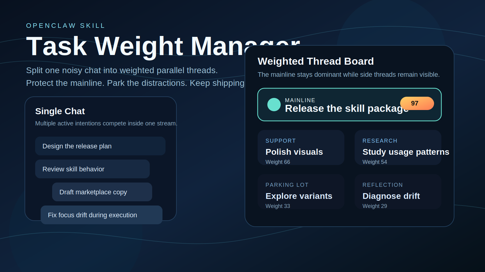
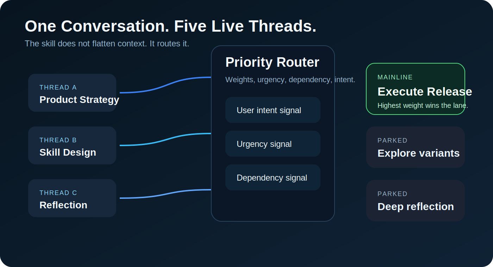
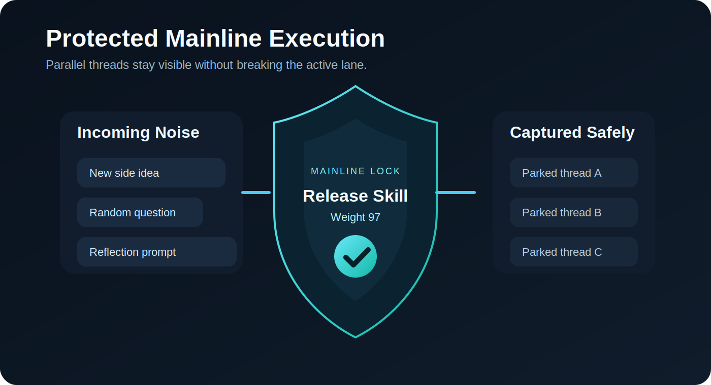

# OpenClaw Task Weight Manager



Task Weight Manager is an OpenClaw skill for one hard problem:

How do you keep a single chat productive when the conversation constantly branches into strategy, research, reflection, side ideas, and urgent interruptions?

This skill turns one noisy conversation into a weighted thread system. It identifies the current mainline, ranks parallel threads, parks distractions, and keeps the agent moving toward the highest-value outcome.

## What It Feels Like

- One chat becomes multiple structured threads.
- The mainline stays visible and protected.
- Side topics stop hijacking execution.
- New ideas are captured without breaking momentum.
- Periodic review pulls the agent back when drift begins.



## Core Concept

Most chat systems flatten everything into one stream.

Task Weight Manager does the opposite. It treats the conversation as a dynamic board of parallel threads:

- `Mainline`: the work that should win right now
- `Support`: useful context that helps the mainline
- `Research`: exploration that should not interrupt delivery
- `Reflection`: self-improvement and strategy
- `Parking Lot`: valid ideas that are not worth switching to yet

Each thread gets a weight based on priority, urgency, dependency, and explicit user intent.

## Why It Is Useful

- Ideal for users who think in fragments
- Ideal for long chats where context drift kills execution
- Useful when one session mixes planning, doing, and reflecting
- Useful when the user wants focus, not just memory



## What The Skill Does

- Classifies interleaved turns into named threads
- Assigns weights and promotes the strongest thread to `mainline`
- Parks interruptions instead of letting them consume the response
- Supports manual commands like re-weighting and focus lock
- Works with OpenClaw `HEARTBEAT.md`, `cron`, `memory`, and `session`

## Quick Start

```bash
cd openclaw-task-weight-manager
python3 scripts/bootstrap_workspace.py
```

That creates:

- `task-weight-manager/threads.md`
- `task-weight-manager/decisions.md`
- `HEARTBEAT.md`

Then invoke the skill with prompts like:

- `Use $task_weight_manager to classify this chat into threads and lock the current mainline.`
- `Use $task_weight_manager to re-score all threads and explain the current priority order.`
- `Use $task_weight_manager to park side topics and keep the next 30 minutes focused on delivery.`

## Positioning

This is not a generic to-do list skill.

It is an attention management layer for AI agents operating in a single conversational surface.

The goal is not only to remember more. The goal is to lose focus less.

## Repository Structure

- `openclaw-task-weight-manager/SKILL.md`
- `openclaw-task-weight-manager/agents/openai.yaml`
- `openclaw-task-weight-manager/references/`
- `openclaw-task-weight-manager/assets/`
- `openclaw-task-weight-manager/scripts/`

## Publishing Notes

- GitHub repository: product-style documentation and visuals
- ClawHub listing: skill metadata, branding, and installable package
